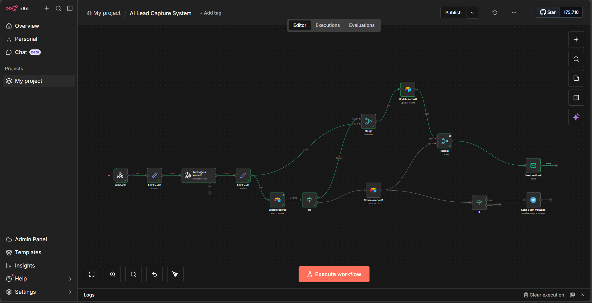
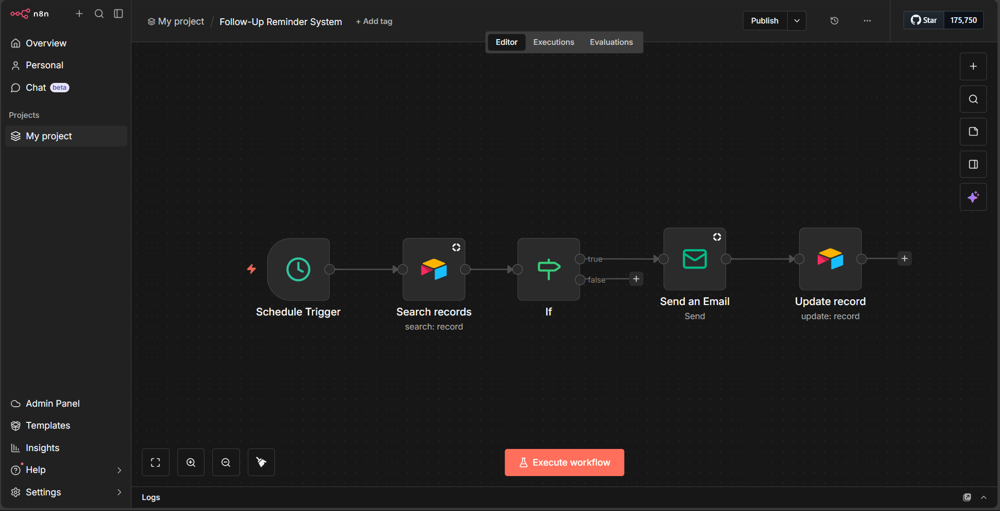
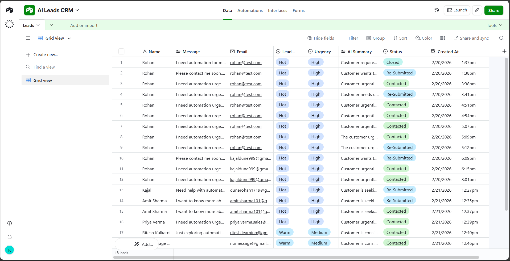

# 🚀 AI Lead Capture + Smart CRM Automation

An AI-powered lead capture and CRM automation system built using **n8n, Airtable, and OpenAI**.

This project automates the complete lifecycle of lead management:
- Capturing leads
- Classifying them using AI
- Storing in CRM
- Sending notifications
- Running automated follow-ups

---

## 📌 Overview

This system consists of two main automation workflows:

1️⃣ **AI Lead Capture System**  
2️⃣ **Follow-Up Reminder System**

It is designed for businesses that want to automate inquiry handling, CRM updates, and smart follow-ups without manual effort.

---

## 🏗 Architecture Flow

### 🔹 Lead Capture Automation
Webhook → n8n → Airtable (Search/Create/Update) → AI Processing → Email/SMS Notification → CRM

### 🔹 Follow-Up Reminder Automation
Schedule Trigger → Airtable → Condition Check → Email Reminder → CRM Update

---

## ⚙ Tech Stack

- **n8n** – Workflow automation engine  
- **Airtable** – CRM database  
- **OpenAI API** – Lead classification & urgency detection  
- **Email Service** – Automated notifications  
- **Webhooks** – Real-time lead intake  

---

## 📂 Project Structure

```
ai-lead-capture-crm-automation/
│
├── workflow/
│   ├── ai-lead-capture-workflow.json
│   └── follow-up-reminder-system.json
│
├── docs/
│   ├── AI Leads CRM Airtable.png
│   ├── Lead Capture Workflow.png
│   └── Follow-Up Reminder Workflow.png
│
├── .env.example
└── README.md
```

---

## 🚀 Features

- ✅ Real-time lead capture via Webhook  
- ✅ Duplicate lead detection  
- ✅ AI-based lead classification  
- ✅ Urgency detection  
- ✅ Automatic record creation & update  
- ✅ Email notifications  
- ✅ Scheduled follow-up reminders  
- ✅ CRM status updates  

---

#### 📸 Workflow Screenshots

### AI Lead Capture Workflow


### Follow-Up Reminder Workflow


### Airtable CRM View

---

## 🛠 Setup Instructions

1. Clone this repository
2. Import workflow JSON files from the `workflow/` folder into n8n
3. Add your credentials in n8n:
   - OpenAI API Key
   - Airtable API Key
   - Email service credentials
4. Configure webhook URL
5. Activate workflows

---

## 🔐 Security Notice

- API keys are NOT included.
- Production webhook URLs are NOT included.
- Use `.env.example` as a reference for configuration.
- Always regenerate credentials before production use.

---

## 👨‍💻 About the Developer

**Rohan Dune**  
AI Automation Developer  

Specializing in workflow automation, CRM systems, and AI-powered business solutions.

📧 Email: dunerohan1719@gmail.com  
💼 Open to freelance AI automation projects  

---

⭐ If you found this project useful, consider giving it a star!
